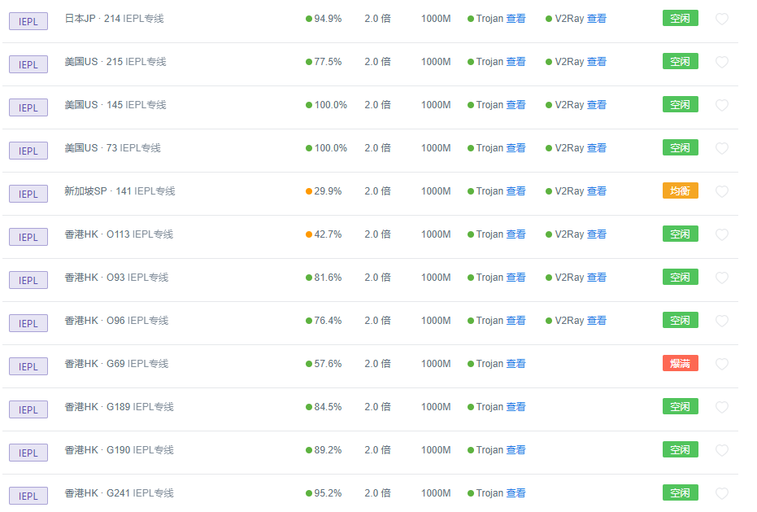
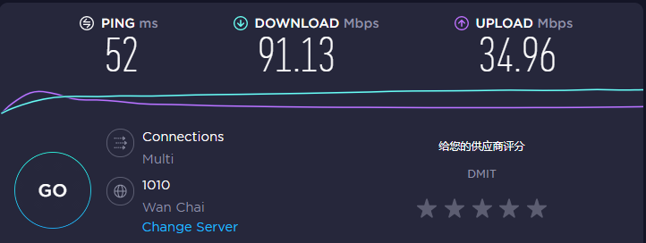
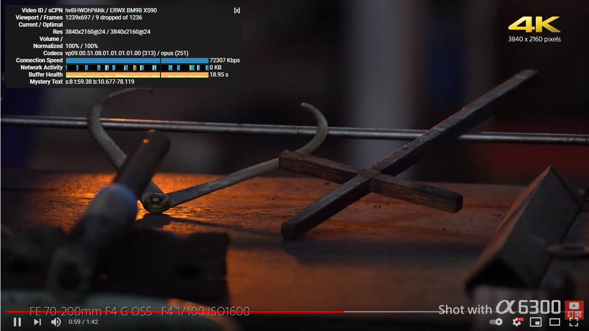
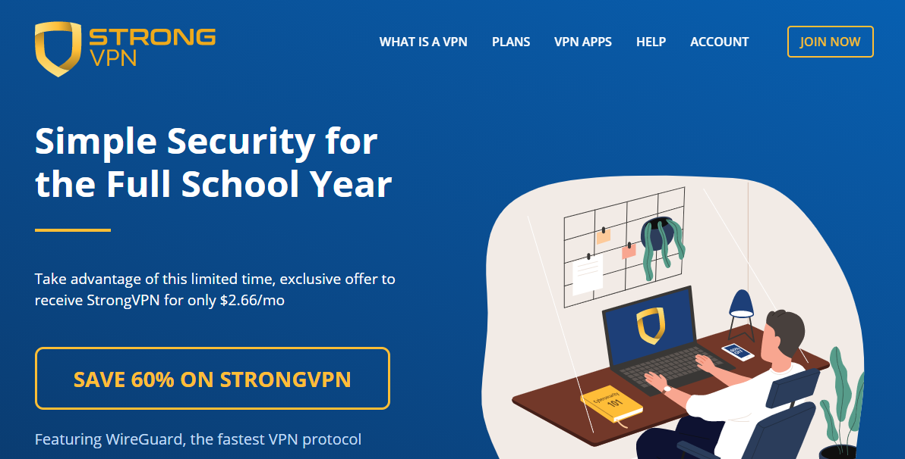
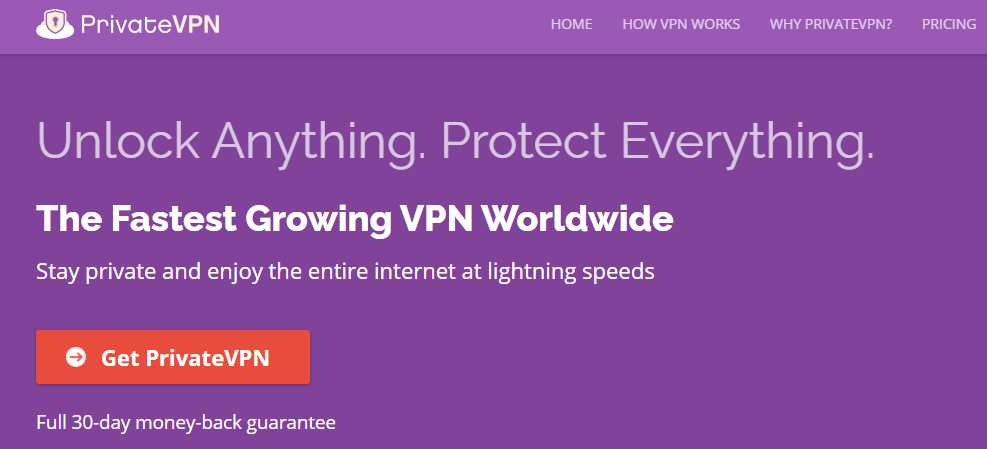

# 整理了四款好用稳定不踩雷的梯子给大家，都是自己用过稳定的

### 最近梯子的更迭速度真的很快，新的牌子络绎不绝层出不穷，我选择梯子向来都是比较谨慎的，没有名气的不用，页面看起来杂乱的不用，线路质量不高的不用，套壳的不用，所以一直以来见过的梯子不少，但是被我留下来稳定好用的梯子真的不多。

这四款梯子，是我这两年用下来真心觉得不错的，并且都是存在了一定时间，跑路风险小的梯子，我会详细说明一下各个梯子的优缺点，大家可以按照自己的情况选择。

这四款梯子都支持电脑和手机，也就是pc和移动端通用的梯子，所以只要选择其中之一，就能满足大家日常上网的需求。

## 一、Westworld 梯子，我心中永远的No.1   [点击进入官网](https://xbsj4621.fun/i/xy080)

西部世界这款梯子在我心中一直都是最好用的，不管是从性价比，线路质量，更新速度，客户端的易用性，页面的清爽程度等各方面一一拿出来看，都无可挑剔。最重要是它提供了新注册用户三天免费试用期，大大降低了试错成本。

我个人的使用感觉下来而言，西部世界的线路节点质量是真的高，全部都采用IEPL专线，质量远比一些中转或者直连的线路要稳定太多了。

我最早时候用过一款梯子，就是用的中转线路，上午和下午时段速度看起来是挺快的，就是一到晚上，也就是大家的上网高峰期，中转线路就会出现网络堵塞，网速和白天根本就不是一个级别，有时候看个视频，都是卡卡顿顿磕磕碰碰，非常头疼。

IEPL专线就没有这种问题，一天24小时随时上网都能保持畅通的网络速度，非常赞。

西部世界目前后台的客户端涵盖了windows/mac/ios/安卓/Linux等主流系统，可以保证日常的上网通讯工具都能够接入他们的节点线路，实现上网的目的，这里强烈推荐他们的mac os客户端，界面干净整洁，真的是最好用的mac客户端梯子。

同时他们的套餐价格也有月付和年付的选项，月付25人民币，年付188人民币，这个价格是比较公道的，至少相信对于大部分人而言都没有负担。

同时我之前也针对西部世界采用分时段的SpeedTest测速，测试结果都令人相当满意，所以如果单从好用程度和稳定程度而言，西部世界是一款适合新手和老手的高性价比梯子软件。

SpeedTest测速结果：

Youtube测速结果：

## 二、StrongVpn  [点击进入官网](https://strongvpn.com/)

这款梯子如果有点英语基础的朋友可以试试，我之前用过一段时间，感觉也确实挺不错的，只是他们的官网界面是纯英文的，没有中文支持。

最早我开始用这款梯子的时候，遇上他们搞活动，是买一年送一年，那时候性价比还是很高了，只是现在这个活动取消之后，个人感觉性价比下降了一大截，但是总体而言，还是一款很不错的梯子软件。

这款梯子的可以使用的节点比较多，也就是节点资源很丰富，但是每一条线路的网络速度会有比较大的差异，也就是说具体哪一条好用，需要大家一条条试过去，找到比较合适的那条然后一直用就可以了。

这款梯子也提供电脑和手机的客户端，同样是只支持英文界面，但就我个人使用下来的感受而言，入门的门槛并不高，稍微有点中小学的英语基础就能够正常操作使用。

## 三、CyberGhost  [点击进入官网](https://www.cyberghostvpn.com/)

这款梯子也是成立时间比较久的梯子了，所以对于是否会跑路等问题大家是不需要担心的，梯子同样支持电脑pc和手机（包括ios以及Andriod）客户端版本，直接下载安装后就可以使用。

就我个人使用感受而言，这款梯子各方面表现都还是很不错的，无论是安全性还是速度，价格会稍微高一点，但也没有达到EXpress Vpn的程度，用来日常工作或者上网浏览视频都是个不错的选择。

但是最让我吐槽的一点，就是他没办法解锁Nexflix，没办法观看奈飞，真的，在这么多梯子当中，这是为数不多无法解锁流媒体的梯子之一。但是对于没有奈飞观看需求的用户来说，这依然是一款不错的梯子。

## 四、PrivateVPN   [点击进入官网](https://privatevpn.com/)

这款梯子在我看来是一款性能比较高的梯子，为什么这么说，因为他只有150多台服务器，这个规模的服务器网络其实应该算是很小型了，刚开始接触的时候，我一度怀疑他的网络会不会不稳定，网速是不是很慢，甚至很容易造成网络拥堵。

但是用了一段时间后发现，他的网速还是比较畅通的，也没有出现我之前顾虑的网络拥堵等情况。

这款梯子也可以解锁奈飞等流媒体影视，让用户正常观看网站视频，并且加密等级也比较高，不会泄漏和保存用户数据。

如果把它作为备用梯子，我相信还是很可靠的。

### 这四款梯子我都是自己去用过，去测试过，综合各方面的因素考虑选择出的[好用稳定的梯子](https://github.com/yourkind/cepingVPN)，如果有需要，大家可以结合自己的实际情况选择使用。
